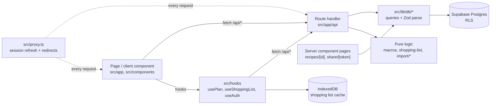

# Architecture Overview

> [!tldr]
> This is a Next.js 16 App Router PWA on Supabase. Pages are thin; client components call `/api/*` route handlers; handlers call `src/lib/db/*` with a cookie-bound Supabase client; **Postgres RLS is the authorization layer**. Pure domain logic (macros, scaling, shopping aggregation, import parsing) lives in `src/lib/` and is unit-tested.

## Context

Start with this page before touching any feature. Each layer below has its own concept page. See [[concepts]].

## Layers



| Layer | Location | Notes |
|---|---|---|
| Proxy | `src/proxy.ts` → `src/lib/supabase/middleware.ts` | Refreshes the session cookie and redirects anyone without a session. See [[auth-session]]. |
| Pages | `src/app/(app)/*`, `(auth)/*`, `share/[token]` | `(app)` pages share `BottomNav`. The recipe detail, recipe edit and share pages are server components that query Supabase directly. |
| Client components | `src/components/{recipes,plan,shopping,import,auth}` | Fetch `/api/*`. Tailwind inline, no shared UI kit. |
| Hooks | `src/hooks/usePlan.ts`, `useShoppingList.ts`, `useAuth.ts` | Wrap fetch plus local state. `useShoppingList` also reads and writes IndexedDB. |
| Route handlers | `src/app/api/**/route.ts` | Thin: parse input, resolve the user's household, call `lib/db`. See [[api-routes]]. |
| Data access | `src/lib/db/{recipes,plans,ingredients,households}.ts` | Takes a `SupabaseClient` argument and validates writes with Zod schemas from `src/lib/schemas.ts`. |
| Pure logic | `src/lib/{macros,scaling,shopping-list,share-token,off}.ts`, `src/lib/import/*` | No I/O except `off.ts`, `import/fetch.ts` and the LLM clients. |
| Database | `supabase/migrations/*` | See [[database-schema]] and [[rls-authorization]]. |

## Invariants and gotchas

- **One Supabase client per request**, created with the user's cookies (`createServerSupabase`). No route uses the service-role key, so every query runs as the user and RLS applies.
- **The household is resolved, not passed in.** Routes that need a household take the caller's *first* `household_members` row (`limit(1)`). A user in two households always acts on whichever row comes first. See [[household-model]].
- **Types are hand-written.** `src/lib/types.ts` mirrors the schema by hand, and joined query results are cast (`as unknown as RecipeWithDetails`), so a schema change won't cause a type error.
- **Validation sits at the lib/db boundary**, not in the route: `RecipeInputSchema`, `PlanSlotInputSchema` and `IngredientInputSchema` are parsed inside `createRecipe`, `upsertSlot` and `createIngredient`.
- **Only the shopping list works offline.** There is no service worker. See [[offline-shopping-store]].
- The LLM work for recipe import runs either in the browser or on the server. See [[llm-modes]].

## Known gaps

- `/` is still the create-next-app landing page, and the root layout's metadata says "Create Next App" with `lang="en"`. See [[spec-drift#Leftover scaffold]].
- Data hooks (`usePlan`, `useShoppingList`, `RecipeList`) fetch inside `useEffect` and set loading state synchronously there. React 19 lint flags this (`react-hooks/set-state-in-effect`, currently a warning). Refactor before making the rule an error again.
- No error boundary or `error.tsx`, and fetch errors in hooks are mostly ignored (`if (r.ok)` with no else branch).

## Examples

```ts
// The typical route shape (src/app/api/recipes/route.ts, POST)
const supabase = await createServerSupabase();
const { data: { user } } = await supabase.auth.getUser();
const { data: household } = await supabase
  .from('household_members').select('household_id').eq('user_id', user.id).limit(1).single();
const recipe = await createRecipe(supabase, body, user.id, household.household_id);
```

## Related

- [[concepts]]
- [[api-routes]]
- [[database-schema]]
- [[rls-authorization]]
- [[import-pipeline]]
- [[0001-rls-is-the-authz-boundary]]
- [[local-dev-setup]]

## Sources

- `src/app/**`, `src/proxy.ts`, `src/lib/**`, `src/hooks/**`, `package.json` (Next `16.3.5`, React `19.2.8`)

## Changelog

- 2026-10-04: Created.
