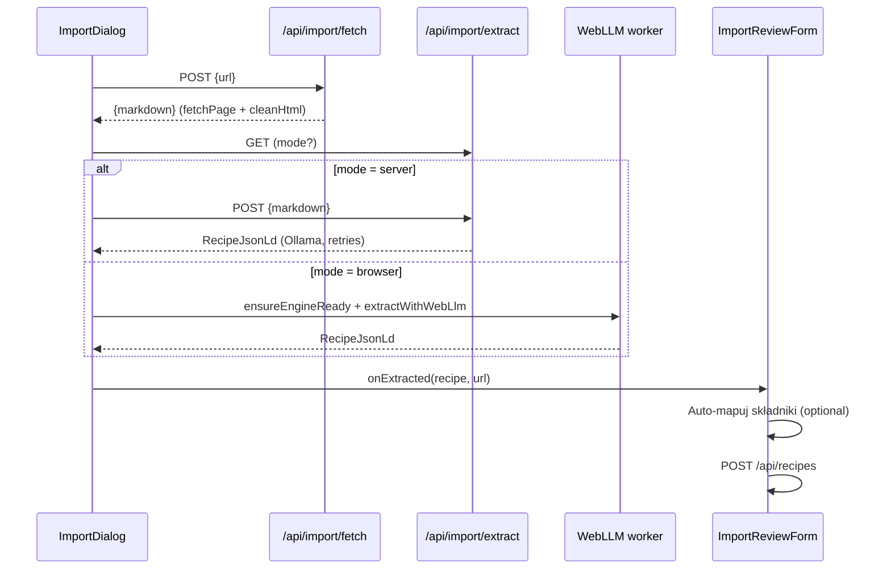

# Import Pipeline

> [!tldr]
> „Import z URL" on `/recipes/new` runs three stages. **Fetch and clean** happens on the server (HTML → Markdown). **Extract** runs an LLM, either WebLLM in the browser or Ollama on the server depending on `LLM_MODE`, and produces a validated `RecipeJsonLd`. **Review**: the user edits the result, auto-matches ingredients and saves through the normal `POST /api/recipes`. Nothing is saved without that review.

## Context

The target sites are jadlonomia.com and aniagotuje.pl. Each stage has its own page. This page shows how they connect. See [[concepts]].

## How it works



| Stage | Page |
|---|---|
| Fetch (`fetchPage`: custom User-Agent, throws on non-2xx) + clean (`cleanHtml`) | [[html-cleaning]] |
| Choosing browser or server | [[llm-modes]] |
| Prompt, grammar, validation, retries | [[llm-extraction]] |
| Mapping ingredient lines to DB rows | [[ingredient-auto-match]] |
| `recipeYield` → servings | [[recipe-yield-parsing]] |

The `ImportDialog` stage machine is `idle → fetch → (model) → extract → done`, and any exception moves it to `error`, with the message shown inline. `/recipes/new` swaps `RecipeForm` for `ImportReviewForm` once a recipe has been extracted, and passes the source URL through as `source_url` (commit `b1bd2db`).

## Invariants and gotchas

- **Review is mandatory.** `ImportReviewForm.save` refuses to save until at least one ingredient is mapped („Zmapuj co najmniej jeden składnik przed zapisem.").
- Imported recipes get `prep_time_min: null`, `diet_tags: []`, `allergens: []` and `visibility: 'household'`. The extracted `prepTime` is dropped.
- `recipeInstructions` can be a string, an array of strings, or an array of `{text}`. The review form normalises all three into step strings.
- Review Focus #3 (a page with no recipe) ends in an `extractRecipe` error after retries. Nothing is saved.

## Known gaps

- `/api/import/fetch` fetches any URL for any signed-in user (SSRF). See [[api-routes]].
- No caching. Importing the same URL twice repeats the fetch and the LLM run.

## Examples

```bash
# Server mode end to end (see the Ollama guide)
LLM_MODE=server pnpm dev
```

## Related

- [[concepts]]
- [[html-cleaning]]
- [[llm-modes]]
- [[llm-extraction]]
- [[ingredient-auto-match]]
- [[recipe-yield-parsing]]
- [[recipe-management]]

## Sources

- `src/components/import/*`, `src/app/(app)/recipes/new/page.tsx`, `src/app/api/import/**`, `src/lib/import/fetch.ts`

## Changelog

- 2026-10-04: Created from legacy `import.md`. Fixed the stale "review form doesn't auto-match" claim.
