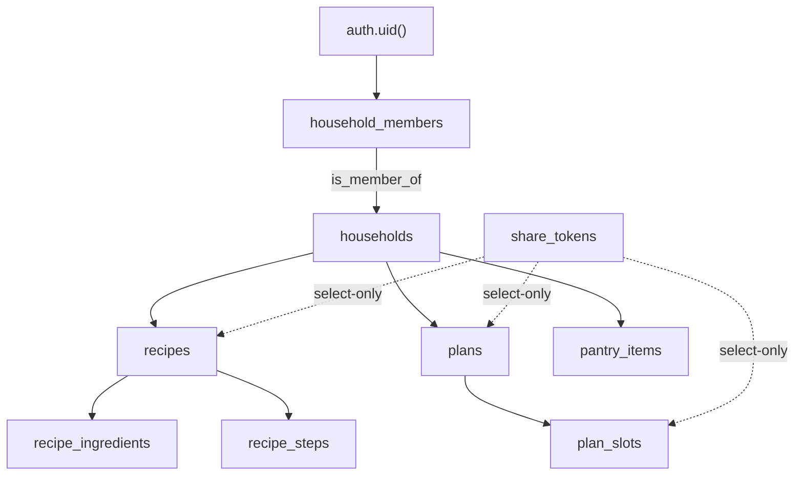

# RLS Authorization

> [!tldr]
> Route handlers don't check permissions; Postgres RLS does. Access is "member of the row's household", tested by `is_member_of()`. Ingredients are crowd-sourced (any signed-in user can edit any row). Several policies are looser than they look: tokens are publicly listable, users can join any household, and any member can edit any household recipe.

## Context

Every query runs as the user, through the anon key and the session cookie (see [[auth-session]]), so a missing or loose policy is a real hole. The full policy list is in [[database-schema#RLS policies]]. This page explains the model and its risks. See [[concepts]].

## How it works



- `is_member_of(hid)` is `security definer`, so it can read `household_members` without hitting that table's own policies recursively.
- Child tables (`recipe_ingredients`, `recipe_steps`, `plan_slots`) check access through their parent with `exists (…)`.
- Same-command policies are OR'd. The share-token policies **add** anonymous read paths alongside the member policies. See [[share-links]].

## Where the code adds checks anyway

- `inviteMember` checks caller membership explicitly (see [[household-model]]).
- `POST /api/recipes`, `/api/plans` and `/api/shopping` resolve the household server-side, so the client can't choose one.

## Invariants and gotchas

- **An RLS-filtered write isn't an error.** A delete or update that RLS hides affects 0 rows and returns no error. `DELETE /api/recipes/[id]` from a non-author returns 204 and deletes nothing, and the UI then navigates away as if it had worked.
- **An RLS-hidden join returns null.** `getWeekPlan` embeds `recipe:recipes(…)`. If the recipe isn't visible, `slot.recipe` is null while `slot.recipe_id` is set, which is why the UI shows „przepis usunięty". See [[week-plan]].
- When adding a table, enable RLS **and** write policies in the same migration. A table with RLS enabled and no policies denies everything, which fails safe but is confusing.

## Known gaps

| Policy | Looseness | Impact |
|---|---|---|
| `st_select using (true)` | Anyone holding the anon key can list **all** share tokens | Every shared plan, and every recipe in it, can be enumerated |
| `hm_insert` | `user_id = auth.uid()` passes for any `household_id` | A user can add themselves to any household whose UUID they know, including as `owner` |
| `rec_update` | Author **or** any member | Any member can edit any household recipe, including `author_id` (as the plan specified) |
| `ing_update` | Any signed-in user, any row | Anyone can change any ingredient's macros (intentional crowd-sourcing) |
| `rec_select` `visibility = 'public_link'` | Readable without membership | No UI sets `public_link`, so this is latent |

## Examples

```sql
-- Reproduce the token-enumeration gap with the anon role
set role anon;
select token, plan_id from share_tokens;  -- returns every token
```

## Related

- [[concepts]]
- [[database-schema]]
- [[household-model]]
- [[share-links]]
- [[0001-rls-is-the-authz-boundary]]
- [[0003-share-token-rls]]

## Sources

- `supabase/migrations/0001_initial.sql`, `0002_share_token_rls.sql`
- `AGENTS.md`: "RLS is the authorization boundary"

## Changelog

- 2026-10-04: Created from the RLS notes in legacy `database.md`. Added the token-enumeration, self-join and silent-delete findings.
