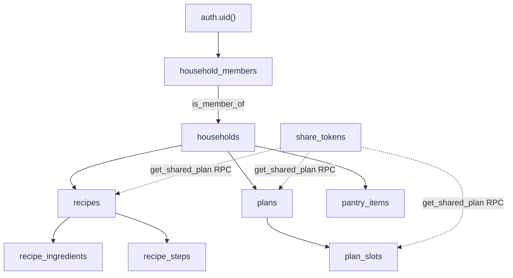

# RLS Authorization

> [!tldr]
> Route handlers don't check permissions; Postgres RLS does. Access is "member of the row's household", tested by `is_member_of()`. Ingredients are crowd-sourced (any signed-in user can edit any row). Since migration 0004, member policies apply to `authenticated` only, and invites, member removal and token creation are locked down. Since 0005, anonymous share links go through the `get_shared_plan` RPC, not policies. Still loose: any member can edit any household recipe.

## Context

Every query runs as the user, through the anon key and the session cookie (see [[auth-session]]), so a missing or loose policy is a real hole. The full policy list is in [[database-schema#RLS policies]]. This page explains the model and its risks. See [[concepts]].

## How it works



- `is_member_of(hid)` is `security definer`, so it can read `household_members` without hitting that table's own policies recursively. `is_owner_of(hid)` works the same way. Both pin `search_path` and only `authenticated` can execute them.
- Member policies are `to authenticated`. `anon` reaches data only through `ing_select` and the `get_shared_plan` RPC (0005). A policy that applies to `anon` must not call `is_member_of`: `anon` has no `execute` on it, so the query would fail instead of returning no rows.
- Child tables (`recipe_ingredients`, `recipe_steps`, `plan_slots`) check access through their parent with `exists (…)`.
- Same-command policies are OR'd. Sharing adds no policies: `get_shared_plan` is `security definer` and returns only what a token unlocks. See [[share-links]] and [[0008-share-link-rpc]].

## Where the code adds checks anyway

- `inviteMember` checks caller membership explicitly (see [[household-model]]).
- `POST /api/recipes`, `/api/plans` and `/api/shopping` resolve the household server-side, so the client can't choose one.

## Invariants and gotchas

- **An RLS-filtered write isn't an error.** A delete or update that RLS hides affects 0 rows and returns no error. `DELETE /api/recipes/[id]` from a non-author returns 204 and deletes nothing, and the UI then navigates away as if it had worked.
- **An RLS-hidden join returns null.** `getWeekPlan` embeds `recipe:recipes(…)`. If the recipe isn't visible, `slot.recipe` is null while `slot.recipe_id` is set, which is why the UI shows „przepis usunięty". See [[week-plan]].
- When adding a table, enable RLS **and** write policies in the same migration. A table with RLS enabled and no policies denies everything, which fails safe but is confusing.

## Known gaps

| Policy | Looseness | Impact |
|---|---|---|
| `rec_update` | Author **or** any member | Any member can edit any household recipe, including `author_id` (as the plan specified). Since 0004 a recipe can't be moved into a foreign household. |
| `ing_update` | Any signed-in user, any row | Anyone can change any ingredient's macros (intentional crowd-sourcing) |
| `rec_select` `visibility = 'public_link'` | Readable by any signed-in user without membership | No UI sets `public_link`, so this is latent. Since 0004 `anon` can't read it. |

Fixed in 0005: `st_select using (true)` and the `*_select_via_share_token` policies (token and plan enumeration).

Fixed in 0004: `hm_insert` (self-join, even as owner), `hm_delete` (any member could remove anyone, including the owner), `households_insert` (open to `anon`), `st_insert` (a token for any plan, which exposed that plan through the share-token policies), and `anon` execute on the `security definer` functions.

## Examples

```sql
-- As anon: no table access, only the RPC (since 0005)
set role anon;
select count(*) from share_tokens;     -- 0
select get_shared_plan('<token>');     -- the plan that token unlocks, or null
```

## Related

- [[concepts]]
- [[database-schema]]
- [[household-model]]
- [[share-links]]
- [[0001-rls-is-the-authz-boundary]]
- [[0003-share-token-rls]]
- [[0008-share-link-rpc]]

## Sources

- `supabase/migrations/0001_initial.sql`, `0002_share_token_rls.sql`, `0004_security_hardening.sql`, `0005_share_link_rpc.sql`
- `AGENTS.md`: "RLS is the authorization boundary"

## Changelog

- 2026-10-04: Updated for migration 0005: sharing goes through `get_shared_plan`; token enumeration fixed.
- 2026-10-04: Updated for migration 0004. Moved the fixed gaps out of the table and added the `anon` / `is_member_of` rule.
- 2026-10-04: Created from the RLS notes in legacy `database.md`. Added the token-enumeration, self-join and silent-delete findings.
